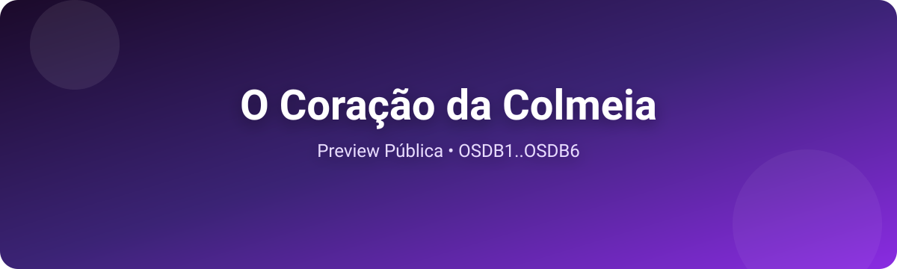

# O Coração da Colmeia · Preview Público

 

Prévia social: <a href="https://lukixfer.github.io/o-coracao-da-colmeia-preview/assets/og-image.png">og-image.png</a>

Bem-vindo(a)! Este repositório contém uma seleção de capítulos da obra de ficção “O Coração da Colmeia” para leitura pública e feedback da comunidade.

## ✨ Sinopse

Entre duas realidades que se espelham e se contaminam — a distopia tecnológica de Miraferro e o mundo mágico de Krawzer —, personagens lutam para manter vínculos, memória e humanidade. A travessia entre mundos cobra um preço: feridas e objetos atravessam, e a mente de Gael abriga a voz de Sophya. Em meio a política, magia elemental e ruído das máquinas, cada escolha acende ou apaga mais um filamento do coração coletivo que dá nome à obra.

## 📚 O que tem nesta preview

- Capítulos em texto puro na pasta `chapters/` (OSDB1 → OSDB6)
- Código de Conduta, Guia de Contribuição e templates de feedback
- Workflow simples de validação para manter os capítulos consistentes

## 🚀 Leia agora

- Capítulo 1: [OSDB1.txt](./chapters/OSDB1.txt)
- Capítulo 2: [OSDB2.txt](./chapters/OSDB2.txt)
- Capítulo 3: [OSDB3.txt](./chapters/OSDB3.txt)
- Capítulo 4: [OSDB4.txt](./chapters/OSDB4.txt)
- Capítulo 5: [OSDB5.txt](./chapters/OSDB5.txt)
- Capítulo 6: [OSDB6.txt](./chapters/OSDB6.txt)

Se preferir, comece pelo primeiro capítulo: [Ler OSDB1 →](./chapters/OSDB1.txt)

## 💬 Como participar

- Deixe seu feedback de leitura (ritmo, clareza, impacto emocional, continuidade):
	- [Abrir feedback de leitura](https://github.com/Lukixfer/o-coracao-da-colmeia-preview/issues/new?template=feedback-leitura.md)
- Sugerir melhoria, ajuste de ortografia/pontuação, ou questionar continuidade:
	- [Sugerir melhoria](https://github.com/Lukixfer/o-coracao-da-colmeia-preview/issues/new?template=sugestao-melhoria.md)
- Quer enviar um ajuste pequeno? Veja o [CONTRIBUTING.md](./CONTRIBUTING.md) e abra um PR.

## 🧭 Para além da preview

Esta é uma amostra. A obra completa (30 capítulos, documentos de mundo e ferramentas de produção) está no repositório principal:

- Repositório principal: https://github.com/Lukixfer/O-Cora-o-da-Colmeia-

## 📐 Convenções (para quem for revisar)

- Português brasileiro, travessão nas falas (— ) e continuidade canônica entre capítulos
- Realidade dupla canônica: Miraferro (urbano distópico) e Krawzer (magia elemental)
- Títulos no topo de cada capítulo: “Capítulo N: Título”

## 📝 Licença

Este projeto de preview é distribuído sob a licença MIT. Veja [LICENSE](./LICENSE). Ao contribuir, você concorda com os termos da licença e com o nosso [Código de Conduta](./CODE_OF_CONDUCT.md).

---

Se esta história tocou você de alguma forma, deixar uma estrela ajuda a obra a alcançar mais leitores. Obrigado por ler! 💛

## 💖 Apoie

Se quiser apoiar a continuidade do projeto, você pode contribuir via Pix:

- Chave Pix (e-mail): `KlausKhaus@hotmail.com`
- Guia rápido: [docs/apoie.md](./docs/apoie.md)
